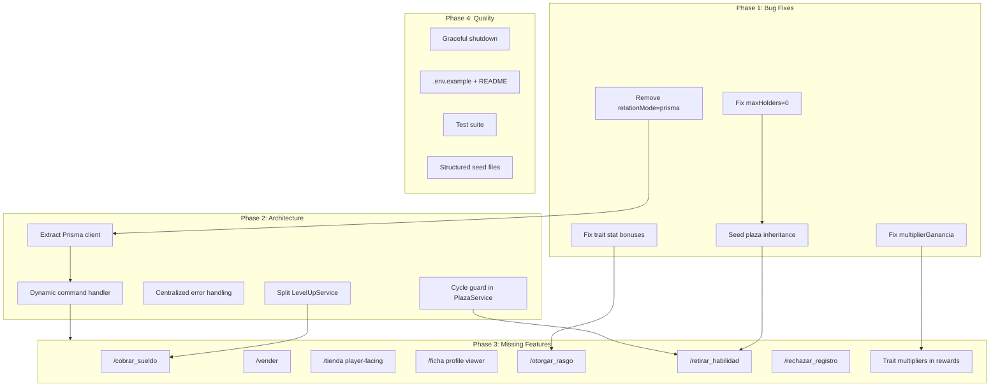

# IZANAGI V2 -- Complete Pending Steps Plan

## Dependency Graph

---

## Phase 1: Critical Bug Fixes (Immediate)

### 1.1 Fix `maxHolders = 0` interpretation

**Files:** [src/services/PlazaService.ts](src/services/PlazaService.ts), [src/database/seedPlazas.ts](src/database/seedPlazas.ts)

- In `PlazaService.assignPlaza()`, change the guard from `plaza.maxHolders <= 0` to `plaza.maxHolders !== -1` (or similar sentinel), treating `0` as "unlimited" to match old system behavior.
- Alternatively, update `seedPlazas.ts` to map `0` to a large number (e.g., `9999`) at parse time. The seed approach is simpler and avoids ambiguous semantics.
- Recommended: seed-side fix (`maxHolders = 0 ? 9999 : parsed`) plus service-side guard `if (plaza.maxHolders > 0 && currentHolders >= plaza.maxHolders)`.

### 1.2 Seed plaza inheritance relationships

**Files:** [src/database/seedPlazas.ts](src/database/seedPlazas.ts)

- The TSV columns 7 (Extras) and 10/11 (Rasgo Gratis) are parsed but discarded. Add a second pass after all plazas are upserted:
  1. For each plaza with non-empty Extras, split by `,`, look up each child plaza by name, and create `PlazaPlazaInheritance` records.
  2. For each plaza with non-empty Rasgo Gratis, look up each trait by name, and create `PlazaTraitInheritance` records.
- This requires reading columns 7 and 10/11 properly (currently column 11 maps to "Rasgo Gratis" but is not stored).
- Use `createMany` with `skipDuplicates: true` for idempotent seeding.

### 1.3 Remove `relationMode = "prisma"`

**Files:** [prisma/schema.prisma](prisma/schema.prisma)

- Delete `relationMode = "prisma"` from the `datasource db` block.
- Run `npx prisma migrate dev` to generate a migration that creates real FK constraints.
- The `@prisma/adapter-pg` driver adapter is still needed for the `pg.Pool` connection; only the relation mode changes.
- **Risk:** If existing data violates FK constraints, the migration will fail. Run a data integrity check first.

### 1.4 Fix trait stat bonuses at character creation

**Files:** [src/services/CharacterService.ts](src/services/CharacterService.ts)

- Currently only `bonusRyou` and `costRC` are summed from traits. The old system applied per-trait stat bonuses from columns 3-8 (EXP, SP, Cupos, stat bonuses).
- Read each trait's `bonusStatName` / `bonusStatValue` and `mechanics` JSON fields.
- Apply: initial EXP bonus (`mechanics.bonusExp`), SP bonus, Cupos bonus, and stat bonuses (e.g., Sabio +2 Chakra) to the character at creation time within the same transaction.

### 1.5 Fix `multiplierGanancia` in seed data

**Files:** [src/database/seedRasgo.ts](src/database/seedRasgo.ts)

- Map TSV columns for income multipliers properly:
  - Ambicioso: `multiplierGanancia = 1.5` (Ryou income)
  - Presteza: store EXP multiplier in `mechanics` (e.g., `mechanics.expMultiplier = 1.5`)
  - Arrepentimiento: `mechanics.expMultiplier = 0.5`
  - Leyenda: `mechanics.prMultiplier = 1.25`
  - Presionado: `mechanics.prMultiplier = 0.75`
- Also ensure stat blocks (Torpeza blocks Armas, Lento blocks Velocidad) and Golden Point grants are stored in `mechanics` JSON:
  - `mechanics.blockedStats: string[]`
  - `mechanics.grantedGP: boolean`

---

## Phase 2: Architectural Improvements (Short-Term)

### 2.1 Extract Prisma client to dedicated module

**New file:** `src/lib/prisma.ts`
**Modified:** [src/index.ts](src/index.ts), all 10 command files, all 3 seed scripts

- Move `Pool`, `PrismaPg`, and `PrismaClient` creation into `src/lib/prisma.ts`, exporting `prisma` and a `disconnectPrisma()` function.
- Update all `import { prisma } from '../index'` to `import { prisma } from '../lib/prisma'`.
- This eliminates the circular dependency risk and decouples services from the bot entry point.

### 2.2 Dynamic command handler

**Files:** [src/index.ts](src/index.ts), [src/deploy/deploy-commands.ts](src/deploy/deploy-commands.ts), all command files

- Use a `discord.js Collection<string, Command>` pattern:
  1. Each command file exports `{ data: SlashCommandBuilder, execute: Function }`.
  2. At startup, dynamically read all `.ts`/`.js` files from `src/commands/`, import them, and populate the Collection.
  3. Replace the `switch` statement with `commands.get(interaction.commandName)?.execute(interaction)`.
  4. `deploy-commands.ts` reads the same directory to build the REST payload.
- Adding a new command = creating one file. No other files need editing.

### 2.3 Centralized error handling

**New file:** `src/utils/errorHandler.ts`
**Modified:** [src/index.ts](src/index.ts), all command files

- Create a wrapper function: `async function handleCommand(interaction, executor)` that:
  1. Calls `interaction.deferReply()`.
  2. Runs `executor(interaction)`.
  3. On catch: logs the error with context (command name, user, timestamp), classifies it (validation vs. system), and sends a formatted embed.
- Apply this wrapper in the dynamic command router so individual commands don't need try/catch boilerplate.

### 2.4 Cycle guard in PlazaService

**Files:** [src/services/PlazaService.ts](src/services/PlazaService.ts)

- Add a `visitedPlazaIds: Set<number>` parameter (defaulting to `new Set()`) to `assignPlaza`.
- Before recursing into a child plaza, check if its ID is already in the set. If so, skip (or throw with a descriptive error).
- Pass the set through recursive calls.

### 2.5 Split LevelUpService

**Files:** [src/services/LevelUpService.ts](src/services/LevelUpService.ts)

- Extract into:
  - `src/services/PromotionService.ts` -- rank/level requirement checks and `applyPromotion`.
  - `src/services/SalaryService.ts` -- `claimWeeklySalary`, salary tables, trait bonus logic.
- Update `/ascender`, `/validar_ascenso` to use `PromotionService`.
- The new `/cobrar_sueldo` command (Phase 3) will use `SalaryService`.

---

## Phase 3: Missing Features (Medium-Term)

### 3.1 `/cobrar_sueldo` -- Weekly salary command

**New file:** `src/commands/cobrar_sueldo.ts`

- Player-facing, no special permissions.
- Calls `SalaryService.claimWeeklySalary(discordId)` (logic already exists in LevelUpService).
- Shows salary breakdown: base + trait bonuses + multiplier = total.

### 3.2 `/vender` -- Sell items

**New file:** `src/commands/vender.ts`
**Modified:** [src/services/TransactionService.ts](src/services/TransactionService.ts)

- Implement `TransactionService.sellItems(data: SellDTO)`:
  1. Load character with inventory and traits.
  2. Validate items exist in inventory with sufficient quantity.
  3. Look up each item's base price; apply `SELL_PERCENTAGE = 0.5`.
  4. No trait multipliers on sell (matching old system).
  5. Remove items, credit Ryou, audit log -- all in one transaction.
- Command accepts `items` (comma-separated string with optional `xN` quantity syntax).

### 3.3 `/tienda` -- Player-facing shop browser

**New file:** `src/commands/tienda.ts`

- Clone `/listar_tienda` logic but without `Administrator` permission requirement.
- Same filters: `moneda`, `categoria`, `pagina`.
- Optionally show the player's current balance alongside prices.

### 3.4 `/ficha` -- Character profile viewer

**New file:** `src/commands/ficha.ts`

- Player-facing; optional `usuario` param for staff to view others.
- Query: character + traits + plazas + inventory + recent activity records.
- Display as a rich Discord embed with fields for: stats, rank/level, resources (Ryou/EXP/PR/RC/SP), traits, plazas, inventory summary, and recent activity.

### 3.5 `/otorgar_rasgo` -- Post-creation trait management

**New file:** `src/commands/otorgar_rasgo.ts`
**Modified:** [src/services/CharacterService.ts](src/services/CharacterService.ts)

- Staff command. Operations: `ASIGNAR` (add) or `RETIRAR` (remove).
- Add `CharacterService.addTrait(characterId, traitName)`:
  1. Check incompatibilities with existing traits.
  2. Enforce unique-category rules (ORIGEN, NACIMIENTO allow only one).
  3. Check RC balance for cost.
  4. Apply stat bonuses from trait (`bonusStatName`/`bonusStatValue`).
  5. Deduct RC, create `CharacterTrait`, audit log.
- Add `CharacterService.removeTrait(characterId, traitName)`:
  1. Reverse stat bonuses (multiply by -1).
  2. Reimburse RC (inverted cost).
  3. Delete `CharacterTrait`, audit log.

### 3.6 `/retirar_habilidad` -- Plaza removal

**New file:** `src/commands/retirar_habilidad.ts`
**Modified:** [src/services/PlazaService.ts](src/services/PlazaService.ts)

- Staff command.
- Add `PlazaService.removePlaza(characterId, plazaName)`:
  1. Reverse stat bonuses (`bonusStatName` * -1).
  2. Remove inherited traits (delete `CharacterTrait` records for traits linked via `PlazaTraitInheritance`).
  3. Refund cupos/BTS/BES based on grant type.
  4. Delete `CharacterPlaza`, audit log.
- Per old system: removal is NOT recursive for child plazas (only inherited traits are reverted).

### 3.7 `/rechazar_registro` -- Activity rejection

**New file:** `src/commands/rechazar_registro.ts`

- Staff command (Administrator).
- Set `ActivityRecord.status` to `REJECTED` with an optional reason.
- No rewards applied. Audit log.

### 3.8 Trait multipliers in RewardCalculatorService

**Modified:** [src/services/RewardCalculatorService.ts](src/services/RewardCalculatorService.ts)

- After base reward calculation, load character traits and apply:
  - `multiplierGanancia` for Ryou income (Ambicioso 1.5x).
  - `mechanics.expMultiplier` for EXP (Presteza 1.5x, Arrepentimiento 0.5x).
  - `mechanics.prMultiplier` for PR (Leyenda 1.25x, Presionado 0.75x).
- Apply `Math.floor()` or `Math.round()` to final values (matching old system's rounding).

---

## Phase 4: Quality Improvements (Long-Term)

### 4.1 Graceful shutdown

**Modified:** [src/index.ts](src/index.ts) (or `src/lib/prisma.ts`)

- Listen for `SIGINT` and `SIGTERM`.
- On signal: `client.destroy()`, `await prisma.$disconnect()`, `pool.end()`, then `process.exit(0)`.

### 4.2 `.env.example` and README

**New files:** `.env.example`, update `README.md`

- `.env.example` with all 4 required variables (DATABASE_URL, DISCORD_TOKEN, CLIENT_ID, GUILD_ID).
- README with: setup instructions, seed commands, command list, architecture summary.

### 4.3 Test suite

**New files:** `src/__tests__/` directory

- Add a test framework (vitest or jest).
- Priority targets per ARCHITECTURE.md:
  1. `StatValidatorService` -- stat scales, caps, blocked stats, golden points.
  2. `PromotionService` (split from LevelUpService) -- rank/level requirements.
  3. `PlazaService` -- recursive inheritance, cycle detection.
  4. `TransactionService` -- buy/sell atomicity, trait multipliers.
- Unit tests with mocked Prisma client.

### 4.4 Structured seed files

**Modified:** all seed scripts

- Replace embedded TSV template literals with `.json` files in `prisma/seed-data/`.
- Seed scripts read JSON and upsert. This improves maintainability and diffability.

---

## Execution Order

The phases have internal dependencies. Recommended execution order within each phase:

**Phase 1** (can be done in parallel, except 1.1 before 1.2):
1.1 -> 1.2 (seed fix depends on maxHolders interpretation), 1.3, 1.4, 1.5

**Phase 2** (sequential):
2.1 -> 2.2 -> 2.3, then 2.4 and 2.5 in parallel

**Phase 3** (after Phase 2 architecture is in place):
3.1 depends on 2.5 (SalaryService split)
3.5 depends on 1.4 (trait bonus logic)
3.6 depends on 1.2 + 2.4 (inheritance data + cycle guard)
3.8 depends on 1.5 (multiplier seed fix)
3.2, 3.3, 3.4, 3.7 are independent

**Phase 4** (ongoing, after Phase 2):
4.1 alongside Phase 2, 4.2-4.4 at any time
